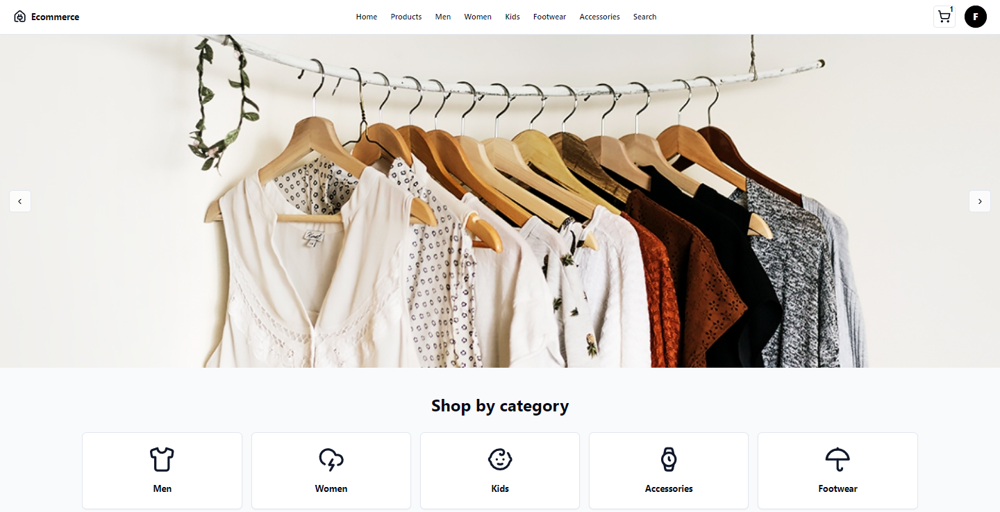

# 🛍️ E-Commerce Shopping Platform



## 🚀 About The Project

This e-commerce platform is a modern, feature-rich online shopping experience built with cutting-edge technologies. It offers a seamless interface for users to browse, filter, and purchase products with ease.

## 🛠️ Built With

- **React**: For building a dynamic and responsive user interface
- **Redux**: For efficient state management across the application
- **Tailwind CSS**: For rapid and customizable styling
- **shadcn/ui**: For beautiful and accessible UI components

## ✨ Key Features

- 🔍 Advanced product filtering and sorting
- 🛒 Intuitive shopping cart functionality
- 💳 Secure checkout process
- 👤 User authentication and profile management
- 📱 Fully responsive design for all devices

## 🏗️ Project Structure

The project follows a modular architecture, with key components including:

- `Shopping_Listing.jsx`: Main product listing page with filtering and sorting
- `ProductFilter`: Component for applying various product filters
- `ShoppingProductTile`: Individual product display component
- `ProductDetailsDialog`: Modal for showing detailed product information

## 🚀 Getting Started

To get a local copy up and running, follow these simple steps:

1. Clone the repo
   ```sh
   git clone https://github.com/your_username/e-commerce-platform.git
   ```
2. Install NPM packages
   ```sh
   npm install
   ```
3. Start the development server
   ```sh
   npm start
   ```

## 🤝 Contributing

Contributions are what make the open-source community such an amazing place to learn, inspire, and create. Any contributions you make are **greatly appreciated**.

1. Fork the Project
2. Create your Feature Branch (`git checkout -b feature/AmazingFeature`)
3. Commit your Changes (`git commit -m 'Add some AmazingFeature'`)
4. Push to the Branch (`git push origin feature/AmazingFeature`)
5. Open a Pull Request

## 📝 License

Distributed under the MIT License. See `LICENSE` for more information.

---

⭐️ Star this repo if you find it helpful!

## 🔗

<br>
<br>

Follow on social media:

[
](https://x.com/M1thuChowdhury)
[
](https://www.linkedin.com/in/iftekharalammithu/)
[
](https://www.instagram.com/iftekharalammithu/)

<div style="text-align: center;">
  <a href="https://www.buymeacoffee.com/iftekharalammithu">
    
  </a>
</div>
